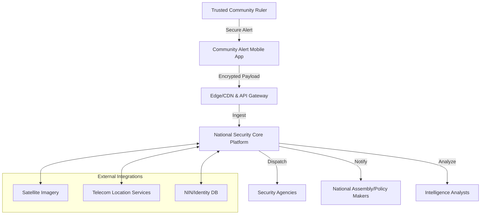
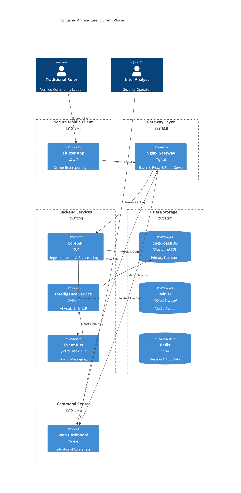
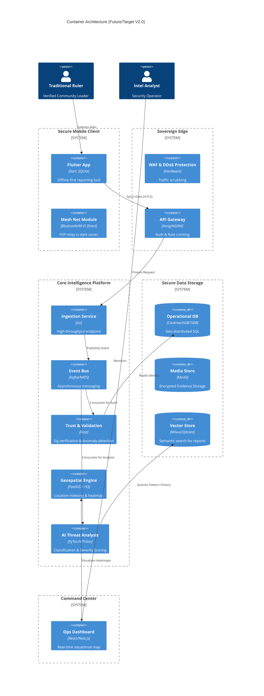

# National Community-Based Security Alert & Intelligence Platform
## Architecture Design Document

**Version**: 1.0
**Status**: DRAFT
**Confidentiality**: SECRET // NOFORN (Simulated)

---

## 1. Executive Summary

This document outlines the architectural design for a sovereign, national-scale security application for Nigeria. The system aims to bridge the gap between traditional community leadership and national security infrastructure. By empowering trusted traditional rulers with a secure, offline-capable mobile reporting tool, and equipping intelligence agencies with a real-time, AI-augmented situational awareness platform, this solution seeks to drastically reduce response times to threats such as insurgency, kidnapping, and natural disasters. The architecture prioritizes data sovereignty, resilience against infrastructure failure, and trust-based verification.

---

## 2. High-Level System Architecture

The system is designed as a distributed, event-driven architecture. It decouples alert acquisition (mobile) from processing (backend) and action (intelligence dashboard) to ensure resilience.

### 2.1 Context Diagram

### 2.2 Container Architecture

#### 2.2.1 Current Implementation (Operational)

#### 2.2.2 Future State (Target Architecture)

---

### 2.3 Database Entity Relationship Diagram (ERD)

```mermaid
erDiagram
    USERS ||--o{ DEVICES : "binds to"
    USERS ||--o{ ALERTS : "submits"
    USERS ||--o{ AUDIT_LOGS : "performs"
    USERS ||--o{ CORROBORATIONS : "verifies"
    
    ALERTS ||--o{ MEDIA_ATTACHMENTS : "contains"
    ALERTS ||--o{ CORROBORATIONS : "receives"

    AGENCIES ||--o{ ASSETS : "owns"
    AGENCIES ||--o{ AGENCY_PERSONNEL : "employs"
    USERS ||--o{ AGENCY_PERSONNEL : "assigned_to"
    
    STATES ||--o{ LGAS : "contains"
    LGAS ||--o{ VILLAGES : "contains"
    
    USERS {
        uuid id PK
        string phone_number UK
        string role
        string monarch_grade
        uuid village_id FK
    }
    
    ALERTS {
        uuid id PK
        uuid user_id FK
        geometry location
        string alert_type
        string status
    }

    AGENCIES {
        uuid id PK
        string name
        string type
        string jurisdiction_scope
    }

    ASSETS {
        uuid id PK
        uuid agency_id FK
        string type
        geometry location
        string status
    }

    AGENCY_PERSONNEL {
        uuid id PK
        uuid agency_id FK
        uuid user_id FK
        string rank
        string department
    }
    
    DEVICES {
        uuid id PK
        uuid user_id FK
        string hwid UK
        string public_key
        string status
    }
    
    MEDIA_ATTACHMENTS {
        uuid id PK
        uuid alert_id FK
        string content_hash_sha256
        string storage_path
    }
    
    CORROBORATIONS {
        uuid id PK
        uuid alert_id FK
        uuid verifier_id FK
        float confidence_score
    }
    
    STATES {
        uuid id PK
        string name UK
        geometry boundary_geom
    }
```

---

## 3. Component Design

### 3.1 Secure Community Alert Mobile Application (Client)
*   **Framework**: Flutter (Cross-platform coverage for low-end Android & iOS).
*   **Offline Capability**: WatermelonDB (Reactive SQLite) for local persistence.
*   **Connectivity Strategy**:
    *   **Store-and-Forward**: Queues alerts when offline; auto-syncs when connection restores.
    *   **SMS Fallback**: Compresses critical encrypted payload into multi-part SMS if data is unavailable.
    *   **Mesh Relay (Future)**: Uses Bluetooth LE/Wi-Fi Direct to hop alerts to nearby connected devices.
*   **Identity**: Hardware-backed Keystore usage (Secure Enclave/Titan M) to sign every alert.

### 3.2 Intelligence & Security Operations Platform (Server)
*   **Ingestion**: Golang-based high-concurrency specialized services.
*   **Real-time Processing**: Stream processing (Apache Flink or similar light alternative) to correlate incoming alerts with active incidents.
*   **Map/Vis**: Mapbox GL JS (Self-hosted/Vector tiles) or Cesium for 3D terrain understanding.

### 3.3 Secure Operations Dashboard (Web)
*   **Framework**: Next.js (React) for high-performance Command & Control interface.
*   **Security Middleware**: Integrated Edge-ready middleware handling RBAC enforcement and session verification.
*   **Observability & Auditing**:
    *   **Access Logging**: Structured JSON logging of every request (Public/Protected) to standard output for non-repudiation.
    *   **Traceability**: Captures IP, User Identity, Role, and Resource Access attempts for intrusion detection.

---

## 4. Technology Stack Recommendations

| Component | Technology Choice | Justification |
| :--- | :--- | :--- |
| **Mobile App** | **Flutter** | Native performance, single codebase, strong offline libraries. |
| **Backend Lang** | **Golang** | High throughput, strict typing, easy concurrency for thousands of community nodes. |
| **Messaging** | **NATS JetStream** | Simpler and faster than Kafka for this scale, persistent, cloud-native. |
| **Database** | **CockroachDB** | Geo-distributed, strongly consistent, survives regional outages (resilience). |
| **Geospatial** | **PostGIS** | Industry standard for advanced queries. |
| **AI Inference** | **Nvidia Triton** | Standardized serving for ML models. |
| **Infrastructure** | **Kubernetes (K8s)** | Container orchestration for scalability and failover. |

---

## 5. Security & Trust Model

### 5.1 Trust Architecture
*   **End-to-End Encryption (E2EE)**: Implementation of the Signal Protocol. Only the sender and authorized command centers can decrypt the payload. Intermediaries (telecoms, ISPs) see opaque blobs.
*   **Non-Repudiation**: Every alert is digitally signed by the private key generated on the user's device during government-verified onboarding.
*   **Device Fingerprinting**: Alerts must match registered device HWIDs.

### 5.2 Authentication
*   **Multi-Factor (MFA)**: Biometric (Face/Fingerprint) + PIN required to open the app.
*   **Duress Mode**: Special "Panic PIN" that unlocks the app but silently flags all actions as forced/duress to HQ.

---

## 6. AI & Geospatial Intelligence

### 6.1 AI-Driven Analysis
*   **Triage Bot**: NLP model (fine-tuned on Nigerian dialects/pidgin) to transcribe voice notes and extract entities (Who, What, Where).
*   **Severity Scoring**: Random Forest classifier trained on historical incident data to assign a 1-10 severity score based on keywords, sender reliability, and velocity of reports.

### 6.2 Geospatial Features
*   **Incident Triangulation**: If multiple rulers report from similar coords, system auto-generates a "Confirmed Incident Zone" polygon.
*   **Asset Tracking Layer**: Real-time visualization of friendly resources (Police Stations, Hospitals) to aid in rapid dispatch and logistics.
*   **Resource Proximity**: Spatial query to identify nearest certified response units (Police/Army checkpoints) relative to the incident.

---

## 7. Risk Analysis & Mitigation

| Risk | Impact | Mitigation Strategy |
| :--- | :--- | :--- |
| **False Alerts** | Waste of resources, loss of trust | "Trust Score" for users. Low-trust users require human triage before dispatch. Penalty mechanism for abuse. |
| **Device Theft/Coercion** | Unauthorized Intel access | Remote Wipe capability. Duress PIN. Periodic re-verification (FaceID check) before sending. |
| **Network Blackout** | inability to report | SMS Fallback channel (USSD/SMPP integration). Satellite uplink for regional hubs. |
| **Insider Threat** | Leaking sensitive intel | RBAC with strict "Need-to-Know" barriers. Immutable audit logs (Write-Once-Read-Many) for all data access. |

---

## 8. Operational Scenarios & Data Flow

### Scenario: Remote Village Attack (No Internet)
1.  **Event**: Ruler witnesses attack.
2.  **Action**: Opens app, enters panic PIN (if under duress) or normal PIN. Records voice note & takes photo.
3.  **Process**: App detects NO DATA. Compresses location + type + timestamp into encrypted binary SMS payload.
4.  **Transport**: SMS sent to dedicated Shortcode.
5.  **Gateway**: SMPP Gateway receives SMS, forwards to Ingestion Service.
6.  **Resolution**: HQ sees "SMS Alert" marker. Dispatches nearest unit based on last known GPS.

---

## 9. Additional Safeguards & Enhancements

### 9.1 The "Web of Trust" Verification
Instead of relying solely on central validation, implement a localized peer-validation system. If a Ruler in Village A reports a massive invasion, the system can automatically prompt Rulers in neighboring Villages B and C (within 5km radius) to "Confirm Status" (Safe/Unsafe) without revealing details. Corroboration increases alert validity instantly.

### 9.2 Immutable Evidence Ledger
Hash all incoming evidence (photos/audio) and store hashes on a private permissioned blockchain (e.g., Hyperledger Besu) hosted by the government. This ensures evidence used in court or tribunals cannot be tampered with post-incident.

### 9.3 Low-Literacy Interface
Use icon-centric UI with voice guidance in local languages (Hausa, Yoruba, Igbo, Pidgin). Instead of typing, user presses "GUNSHOTS" icon, then records voice details.

---

## 10. Phased Implementation Roadmap

*   **Phase 1: Pilot (Months 1-3)** - 3 States (North/South/West), Manual Onboarding, Core App functionality.
*   **Phase 2: Intelligence Layer (Months 4-6)** - AI integration, Ops Dashboard 1.0, SMS Fallback.
*   **Phase 3: National Rollout (Months 7-12)** - Full nationwide onboarding, Inter-agency integrations (Police/Army).
*   **Phase 4: Advanced Tech (Year 2+)** - Satellite integration, Drone dispatch API, Mesh networking.

---

## 11. Evolution & Migration Path

The transition from the **Current Implementation (V1.0)** to the **Future State (V2.0)** is designed as an evolution, minimizing destructive redesign.

### 11.1 Migration Strategy
*   **Microservice Extraction (Medium-High Effort)**: Existing packages within `core-api` (e.g., `audit`, `security`) are architected for extraction into independent Go or Rust services. NATS JetStream serves as the persistent "connective tissue" during this split.
*   **Infrastructure Scaling (High Effort)**: Moving from Docker Compose to Kubernetes (K8s) involves deploying Helm charts and configuring sovereign ingress/ingress controllers (like Kong). Application logic remains largely unchanged.
*   **Data Enrichment (Low Effort)**: New specialized stores (Vector DB, GeoEngine) are added alongside CockroachDB. This is an additive change; existing relational schemas remain the source of truth.
*   **Mobile Capability (Medium Effort)**: Mesh networking (BLE/Wi-Fi Direct) will be implemented as a modular transport provider within the Flutter app, co-existing with existing HTTPS and SMS fallback layers.

### 11.2 Design Debt Mitigation
By enforcing strict package boundaries and adopting asynchronous event-driven patterns early (v1.0), the platform avoids "Technical Debt" and ensures that scaling to national levels (v2.0) is a matter of horizontal expansion rather than logic rewrite.

