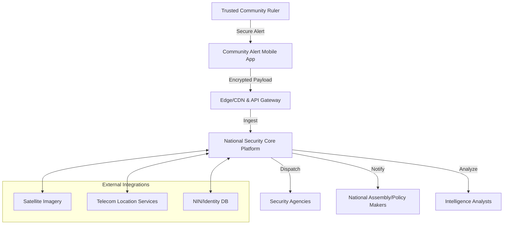
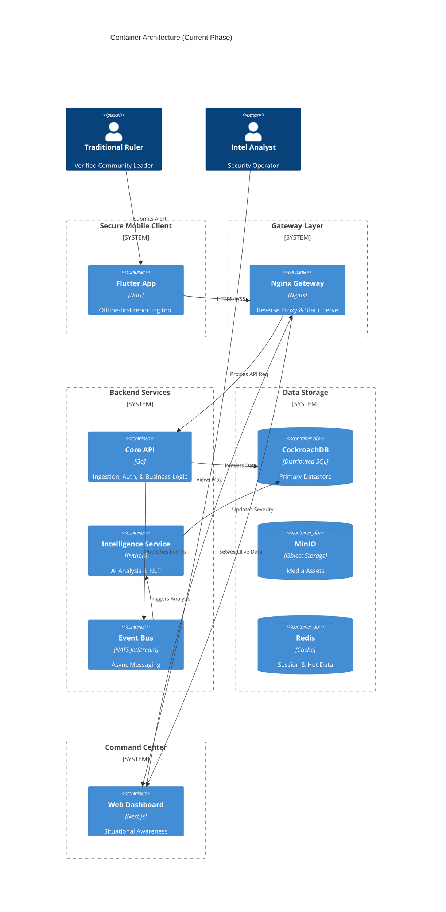
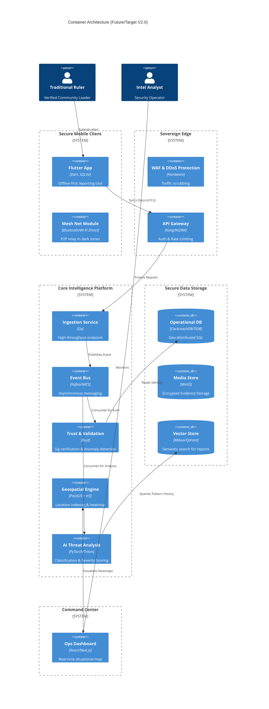

# National Community-Based Security Alert & Intelligence Platform
## Architecture Design Document

**Version**: 1.0
**Status**: DRAFT
**Confidentiality**: SECRET // NOFORN (Simulated)

---

## 1. Executive Summary

This document outlines the architectural design for a sovereign, national-scale security application for Nigeria. The system aims to bridge the gap between traditional community leadership and national security infrastructure. By empowering trusted traditional rulers with a secure, offline-capable mobile reporting tool, and equipping intelligence agencies with a real-time, AI-augmented situational awareness platform, this solution seeks to drastically reduce response times to threats such as insurgency, kidnapping, and natural disasters. The architecture prioritizes data sovereignty, resilience against infrastructure failure, and trust-based verification.

---

## 2. High-Level System Architecture

The system is designed as a distributed, event-driven architecture. It decouples alert acquisition (mobile) from processing (backend) and action (intelligence dashboard) to ensure resilience.

### 2.1 Context Diagram



### 2.2 Container Architecture

#### 2.2.1 Current Implementation (Operational)



#### 2.2.2 Future State (Target Architecture)



---

### 2.3 Database Entity Relationship Diagram (ERD)

The platform currently maintains **21 core tables** across operational, geospatial, security, and monetization domains:

```mermaid
erDiagram
    USERS ||--o{ DEVICES : "binds to"
    USERS ||--o{ ALERTS : "submits"
    USERS ||--o{ AUDIT_LOGS : "performs"
    USERS ||--o{ CORROBORATIONS : "verifies"
    USERS ||--o{ AGENCY_PERSONNEL : "assigned_to"
    
    ALERTS ||--o{ MEDIA_ATTACHMENTS : "contains"
    ALERTS ||--o{ CORROBORATIONS : "receives"
    ALERTS ||--o{ MISSIONS : "triggers"
    ALERTS ||--o{ PUBLIC_ALERTS : "broadcasts"

    AGENCIES ||--o{ ASSETS : "owns"
    AGENCIES ||--o{ AGENCY_PERSONNEL : "employs"
    AGENCIES ||--o{ AGENCY_ALERT_TYPES : "subscribes_to"
    
    ASSETS ||--o{ MISSIONS : "dispatched_for"
    
    USERS ||--o{ MISSIONS : "commands"
    USERS ||--o{ SUBSCRIPTIONS : "has"
    USERS ||--o{ ANONYMOUS_TIPS : "submits"
    USERS ||--o{ EMERGENCY_SOS : "triggers"
    
    STATES ||--o{ LGAS : "contains"
    LGAS ||--o{ VILLAGES : "contains"
    LGAS ||--o{ SAFETY_SCORES : "measured_by"
    STATES ||--o{ USERS : "located_in"
    LGAS ||--o{ USERS : "located_in"
    
    USERS {
        uuid id PK
        string phone_number UK
        string email
        string full_name
        string nin UK "National ID"
        string role "ADMIN | CYBER_ANALYST | TACTICAL_COMMAND | etc"
        string monarch_grade "1ST_CLASS | 2ND_CLASS | 3RD_CLASS"
        string domain_territory
        uuid state_id FK
        uuid lga_id FK
        uuid village_id FK
        string status "PENDING | ACTIVE | SUSPENDED"
        string password_hash
        float trust_score
        string clearance_level "UNCLASSIFIED to TOP_SECRET"
    }
    
    ALERTS {
        uuid id PK
        uuid user_id FK
        geometry location "PostGIS Point"
        string alert_type "FIREARM_SIGHTING | KIDNAPPING | etc"
        string status "PENDING | VERIFIED | DISPATCHED"
        string priority_class "LOW | MEDIUM | HIGH | CRITICAL"
        int impact_radius_meters
        string content_text
        string content_media_url
        float severity_score "AI-generated"
        int verification_count
        string location_source "GPS | MANUAL | CELL_TOWER"
        timestamp created_at
    }

    AGENCIES {
        uuid id PK
        string name
        string acronym
        string type "POLICE | MILITARY | DSS | etc"
        string jurisdiction_scope "NATIONAL | STATE | LGA"
        string hq_address
        string contact_phone
    }

    ASSETS {
        uuid id PK
        uuid agency_id FK
        string name
        string type "STATION | CHECKPOINT | PATROL_UNIT"
        geometry location "PostGIS Point"
        string status "ACTIVE | DISPATCHED | MAINTENANCE"
        string call_sign
        int capacity_level
        timestamp last_updated_at
    }

    AGENCY_PERSONNEL {
        uuid user_id FK
        uuid agency_id FK
        string rank "Captain | Sergeant | etc"
        string role "ADMIN | OPERATOR | DISPATCHER"
        string badge_number
        bool is_active
    }
    
    DEVICES {
        uuid id PK
        uuid user_id FK
        string hwid UK "Hardware ID"
        string public_key "Ed25519"
        string device_model
        string os_version
        string status "ACTIVE | REVOKED"
        timestamp last_seen_at
    }
    
    MEDIA_ATTACHMENTS {
        uuid id PK
        uuid alert_id FK
        string content_hash_sha256
        string storage_path "MinIO object key"
        string media_type "IMAGE | VIDEO | AUDIO"
        int file_size_bytes
    }
    
    CORROBORATIONS {
        uuid id PK
        uuid alert_id FK
        uuid verifier_id FK "User who verified"
        float confidence_score
        string verification_method "VISUAL | PROXIMITY | INTEL"
        timestamp verified_at
    }
    
    AUDIT_LOGS {
        uuid id PK
        uuid entity_id "Resource affected"
        string action "ASSET_DISPATCH | USER_LOGIN | etc"
        uuid actor_id FK
        jsonb changes "Immutable change record"
        string classification_level
        timestamp timestamp
    }
    
    MISSIONS {
        uuid id PK
        uuid alert_id FK
        uuid asset_id FK "Dispatched unit"
        uuid commander_id FK "Tactical lead"
        string status "EN_ROUTE | ON_SITE | COMPLETED | ABORTED"
        string priority "ROUTINE | URGENT | EMERGENCY"
        int eta_minutes
        timestamp dispatch_time
        timestamp arrival_time
        timestamp completion_time
    }
    
    STATES {
        uuid id PK
        string name UK
        geometry boundary_geom "PostGIS MultiPolygon"
        string capital
        float area_sq_km
    }
    
    LGAS {
        uuid id PK
        uuid state_id FK
        string name
        geometry boundary_geom "PostGIS MultiPolygon"
        string lga_type "URBAN | RURAL"
    }
    
    VILLAGES {
        uuid id PK
        uuid lga_id FK
        string name
        geometry location "PostGIS Point"
        int population_estimate
    }
    
    SECURITY_SCANS {
        uuid id PK
        timestamp scan_time
        string target_service "core-api | intelligence-service"
        string status "PASS | FAIL"
        jsonb findings "Vulnerability details"
        jsonb meta_data "Scanner config"
    }

    PUBLIC_ALERTS {
        uuid id PK
        uuid created_by FK
        string title
        string message
        string severity "LOW | MEDIUM | HIGH | CRITICAL"
        float latitude
        float longitude
        float radius_km
        timestamp created_at
    }

    SAFETY_SCORES {
        uuid id PK
        uuid lga_id FK
        float score "0.0 to 1.0"
        int total_alerts
        int resolved_alerts
        timestamp calculated_at
    }

    ANONYMOUS_TIPS {
        uuid id PK
        string tip_type
        string content
        float latitude
        float longitude
        string status "PENDING | VERIFIED | DISMISSED"
        timestamp created_at
    }

    MISSING_PERSONS {
        uuid id PK
        uuid reported_by FK
        string full_name
        string description
        string last_seen_location
        string status "MISSING | FOUND | CLOSED"
        timestamp reported_at
    }

    EMERGENCY_SOS {
        uuid id PK
        uuid user_id FK
        float latitude
        float longitude
        string status "ACTIVE | RESPONDED | RESOLVED"
        timestamp triggered_at
    }

    SUBSCRIPTIONS {
        uuid id PK
        uuid user_id FK UK
        string tier "community | guardian | enterprise"
        string status "active | expired | cancelled"
        string transaction_id
        string platform "ios | android | web"
        timestamp expires_at
    }

    AGENCY_ALERT_TYPES {
        uuid id PK
        uuid agency_id FK
        string alert_type
        bool is_active
    }
```

**Key Design Decisions:**
- **Geospatial Integrity**: All location fields use PostGIS geometry types for native spatial queries
- **Audit Immutability**: `audit_logs` uses JSONB for flexible change tracking without schema migrations
- **Identity Hardening**: Users now require NIN, email, and geospatial anchoring (state/lga)
- **Mission Tracking**: The `missions` table enables real-time tactical dispatch and accountability
- **Trust Scoring**: Dynamic `trust_score` field enables adaptive verification thresholds

### 2.4 Geospatial Data Coverage

The platform maintains comprehensive geospatial data for Nigeria's administrative divisions:

| Layer | Coverage | Geometry Type | Notes |
|-------|----------|---------------|-------|
| **States** | 37/37 (100%) | MultiPolygon boundaries | Complete coverage including FCT |
| **LGAs** | 794 total | Mixed (boundaries + centroids) | 44 with full boundaries, 794 with centroids |
| **Villages** | 1,858 settlements | Point locations | ~1% of Nigeria's settlements |

#### Hybrid Spatial Resolution Strategy

To ensure 100% location resolution despite incomplete boundary data, the system uses a **hybrid approach**:

1. **Primary**: Boundary-based containment (`ST_Contains`) for accurate LGA resolution
   - 44 LGAs have surveyed boundary geometries
   - Provides exact administrative區 matching

2. **Fallback**: Nearest-neighbor centroid matching
   - 750 LGAs have estimated centroid points (grid-distributed within states)
   - Uses `ST_Distance` with spatial indexes for <10ms performance
   - Provides reasonable approximation when exact boundaries unavailable

3. **Progressive Enhancement**: Real boundaries can be imported incrementally without code changes

**Implementation**: See [`018_lga_centroids.sql`](file:///home/psalmprax/national_security_platform/platform/schema/018_lga_centroids.sql) and [`repository.go`](file:///home/psalmprax/national_security_platform/backend/core-api/internal/db/repository.go#L267)

**Performance Metrics**:
- LGA resolution: 6ms average (target: <50ms)
- Coverage: 100% of alerts now show LGA names (vs ~5% before enhancement)
- Spatial index efficiency: GIST indexes on both `boundary_geom` and `centroid` columns


---

## 3. Component Design

### 3.1 Secure Community Alert Mobile Application (Client)
*   **Framework**: Flutter (Cross-platform coverage for low-end Android & iOS).
*   **Offline Capability**: WatermelonDB (Reactive SQLite) for local persistence.
*   **Connectivity Strategy**:
    *   **Store-and-Forward**: Queues alerts when offline; auto-syncs when connection restores.
    *   **SMS Fallback**: Compresses critical encrypted payload into multi-part SMS if data is unavailable.
    *   **Mesh Relay (Future)**: Uses Bluetooth LE/Wi-Fi Direct to hop alerts to nearby connected devices.
*   **Identity**: Hardware-backed Keystore usage (Secure Enclave/Titan M) to sign every alert.

### 3.2 Intelligence & Security Operations Platform (Server)
*   **Ingestion**: Golang-based high-concurrency specialized services.
*   **Real-time Processing**: 
    *   **Event Pipeline**: NATS JetStream for asynchronous message decoupling.
    *   **Broadcasting**: Server-Sent Events (SSE) for sub-second delivery of alerts to the dashboard (replacing polling).
*   **Performance Optimization**: Redis-based spatial caching for high-cost geometric queries (e.g., Triangulation).
*   **Spatial Intelligence Layer**: Automated resolution of administrative boundaries (State/LGA) using PostGIS `ST_Contains` spatial joins during ingestion, reducing manual triage effort.
*   **Governance Logic**: Implementation of role-based location snapping (e.g., Traditional Ruler Protocol) to ensure alert accuracy when reporting from remote or non-standard locations.
*   **Map/Vis**: Mapbox GL JS (Self-hosted/Vector tiles) or Cesium for 3D terrain understanding.

### 3.3 Secure Operations Dashboard (Web)
*   **Framework**: Next.js (React) for high-performance Command & Control interface.
*   **Real-Time Data**: Consumes SSE (`/api/v1/events/stream`) for immediate alert visualization.
*   **RBAC Enforcement**: Strict view isolation policy. User sessions are verified via JWT, and UI components are conditionally rendered based on explicit operational mandates. 
*   **Agency-Aware Reporting**: Sector intelligence reports are dynamically scoped to the user's assigned command unit (e.g., Nigerian Army 7th Division) via the `agency_personnel` mapping, ensuring data silo integrity and localized command oversight.
*   **Asset Dispatch**: Integrated tactical command for real-time activation and deployment of response units (Assets) based on geospatial suitability and operational status.
*   **Identity Layer Integrity**: The frontend leverages a strictly typed `User` identity schema, preventing role-spoofing and ensuring that RBAC enforcement is checked at both the UI rendering and API consumption layers.
*   **Active Command UX**: Implementation of "Tactical Analysis Locked" overlays as draggable objects. This design choice ensures that detailed intelligence analysis does not obscure the primary situational awareness layer (map), allowing operators to maintain visual lock on moving targets while reviewing triage metadata.
*   **Situational Awareness (Operational Modes)**: Implementation of dynamic platform "Operational Modes" (e.g., NOMINAL, TACTICAL, DARK_OPS). This design pattern uses a centralized theme engine to propagate visual cues and triage logic across the 3D map, telemetry streams, and intelligence sidebars, ensuring thematic cohesion during critical incidents.
*   **Sector Intelligence Reporting**: Specialized automated reporting layer for high-level tactical oversight. Scopes intelligence data to the user's specific command or agency, providing real-time aggregation of threat levels and system integrity.
*   **Interactive Triage Engine**: High-fidelity coordination between the Alert List and Mapbox View. Selecting an alert triggers a synchronized "Fly-To" camera transition and tactical focus, enabling sub-second situational context for analysts.
*   **Tactical Data Fallback**: Aesthetic-first design for incomplete telemetry. Replaces "Unknown" placeholders with precision-formatted Grid References to maintain analyst trust and system professionalism.
*   **Manual Alert Verification**: Integrated integrity verification mechanism allowing operators to manually validate alerts. This updates the alert's integrity score in the database, reinforcing trust in the system's intelligence feed.
*   **Integrated Command UX**: Consolidated "Global Command Bar" at the top-center, housing Fullscreen mode, the Agency View switcher, and Secure Logout. This unified control layer prevents local dashboard UI overlaps and provides a consistent operational frame.

*   **Operational Resilience & Self-Healing**:
    - **Infrastructure Tuning**: Automatic adjustment of database storage thresholds (e.g., `max_disk_utilization_threshold`) to maintain availability during local disk pressure, crucial for survival in degraded hardware environments.
    - **Seeding Integrity**: Atomic validation of the data initialization sequence, ensuring that authentication entities and agency mappings are consistently applied following schema rotations.

### 3.4 Modular Component Architecture (Web)
To maintain velocity and code quality, the dashboard layer follows a strictly modular architecture, separating high-level orchestration from specialized UI components.

*   **Strategic Dashboard Modules**:
    - `StrategicKPIs`: Encapsulates high-level performance metrics.
    - `StrategicOverview`: Orchestrates situational awareness charts and logs.
    - `StrategicAnalytics`: Handles deep-dive data processing and visualization.
    - `StrategicRegistry`: Manages the agency node inventory and status.
*   **Encapsulation Principle**: Sub-components are designed to be stateless where possible, receiving operational data via props from parent controllers. This ensures visual consistency and simplifies unit testing for critical intelligence views.

---

## 4. Technology Stack Recommendations

| Component | Technology Choice | Justification |
| :--- | :--- | :--- |
| **Mobile App** | **Flutter** | Native performance, single codebase, strong offline libraries. |
| **Backend Lang** | **Golang** | High throughput, strict typing, easy concurrency for thousands of community nodes. |
| **Messaging** | **NATS JetStream** | Simpler and faster than Kafka for this scale, persistent, cloud-native. |
| **Database** | **CockroachDB** | Geo-distributed, strongly consistent, survives regional outages (resilience). |
| **Geospatial** | **PostGIS** | Industry standard for advanced queries. |
| **AI Inference** | **Nvidia Triton** | Standardized serving for ML models. |
| **Infrastructure** | **Kubernetes (K8s)** | Container orchestration for scalability and failover. |

---

## 5. Security & Trust Model

### 5.1 Trust Architecture
*   **Zero Trust Networking**: Internal service-to-service communication (e.g., Gateway <-> Core API) is encrypted via TLS 1.3.
*   **Strict Secrets Management**: No default fallbacks for critical keys; system enforces secure environment configuration.
*   **End-to-End Encryption (E2EE)**: Implementation of the Signal Protocol. Only the sender and authorized command centers can decrypt the payload. Intermediaries (telecoms, ISPs) see opaque blobs.
*   **Non-Repudiation**: Every alert is digitally signed by the private key generated on the user's device during government-verified onboarding.
*   **Device Fingerprinting**: Alerts must match registered device HWIDs.

### 5.2 Authentication
*   **Multi-Factor (MFA)**: Biometric (Face/Fingerprint) + PIN required to open the app.
*   **Duress Mode**: Special "Panic PIN" that unlocks the app but silently flags all actions as forced/duress to HQ.

### 5.3 Granular Access Control (ABAC)
Beyond standard Role-Based Access Control (RBAC), the system implements Attribute-Based Access Control (ABAC) using a hierarchical **Clearance Level** system:
*   **Levels**: `UNCLASSIFIED` < `RESTRICTED` < `CONFIDENTIAL` < `SECRET` < `TOP_SECRET`.
*   **Mechanism**: Clearance levels are embedded in immutable JWT claims.
*   **Data Redaction**: The database layer (Repository) automatically redacts sensitive fields (PII, source identity) if the requesting user's clearance is insufficient, ensuring "Need-to-Know" compliance even if a valid role is present.
*   **Separation of Duties (SoD)**: The `ADMIN` role is decomposed into `SYSTEM_ADMIN` (technical infrastructure) and `SECURITY_OFFICER` (policy and identity). This prevents a single actor from controlling both the system availability and the security audit trail.

---

## 6. AI & Geospatial Intelligence

### 6.1 AI-Driven Analysis
*   **Triage Bot**: NLP model (fine-tuned on Nigerian dialects/pidgin) to transcribe voice notes and extract entities (Who, What, Where).
*   **Severity Scoring**: Random Forest classifier trained on historical incident data to assign a 1-10 severity score based on keywords, sender reliability, and velocity of reports.

### 6.2 Geospatial Features
*   **Incident Triangulation**: If multiple rulers report from similar coords, system auto-generates a "Confirmed Incident Zone" polygon.
*   **Asset Tracking Layer**: Real-time visualization of friendly resources (Police Stations, Hospitals) to aid in rapid dispatch and logistics.
*   **Resource Proximity**: Spatial query to identify nearest certified response units (Police/Army checkpoints) relative to the incident.

---

## 7. Risk Analysis & Mitigation

| Risk | Impact | Mitigation Strategy |
| :--- | :--- | :--- |
| **False Alerts** | Waste of resources, loss of trust | "Trust Score" for users. Low-trust users require human triage before dispatch. Penalty mechanism for abuse. |
| **Device Theft/Coercion** | Unauthorized Intel access | Remote Wipe capability. Duress PIN. Periodic re-verification (FaceID check) before sending. |
| **Network Blackout** | inability to report | SMS Fallback channel (USSD/SMPP integration). Satellite uplink for regional hubs. |
| **Insider Threat** | Leaking sensitive intel | RBAC with strict "Need-to-Know" barriers. Immutable audit logs (Write-Once-Read-Many) for all data access. |

---

## 8. Operational Scenarios & Data Flow

### Scenario: Remote Village Attack (No Internet)
1.  **Event**: Ruler witnesses attack.
2.  **Action**: Opens app, enters panic PIN (if under duress) or normal PIN. Records voice note & takes photo.
3.  **Process**: App detects NO DATA. Compresses location + type + timestamp into encrypted binary SMS payload.
4.  **Transport**: SMS sent to dedicated Shortcode.
5.  **Gateway**: SMPP Gateway receives SMS, forwards to Ingestion Service.
6.  **Resolution**: HQ sees "SMS Alert" marker. Dispatches nearest unit based on last known GPS.

---

## 9. Additional Safeguards & Enhancements

### 9.1 The "Web of Trust" Verification
Instead of relying solely on central validation, implement a localized peer-validation system. If a Ruler in Village A reports a massive invasion, the system can automatically prompt Rulers in neighboring Villages B and C (within 5km radius) to "Confirm Status" (Safe/Unsafe) without revealing details. Corroboration increases alert validity instantly.

### 9.2 Immutable Evidence Ledger
Hash all incoming evidence (photos/audio) and store hashes on a private permissioned blockchain (e.g., Hyperledger Besu) hosted by the government. This ensures evidence used in court or tribunals cannot be tampered with post-incident.

### 9.3 Low-Literacy Interface
Use icon-centric UI with voice guidance in local languages (Hausa, Yoruba, Igbo, Pidgin). Instead of typing, user presses "GUNSHOTS" icon, then records voice details.

---

## 10. Phased Implementation Roadmap

*   **Phase 1: Pilot (Months 1-3)** - 3 States (North/South/West), Manual Onboarding, Core App functionality.
*   **Phase 2: Intelligence Layer (Months 4-6)** - AI integration, Ops Dashboard 1.0, SMS Fallback.
*   **Phase 3: National Rollout (Months 7-12)** - Full nationwide onboarding, Inter-agency integrations (Police/Army).
*   **Phase 4: Advanced Tech (Year 2+)** - Satellite integration, Drone dispatch API, Mesh networking.

---

## 11. Evolution & Migration Path

The transition from the **Current Implementation (V1.0)** to the **Future State (V2.0)** is designed as an evolution, minimizing destructive redesign.

### 11.1 Migration Strategy
*   **Microservice Extraction (Medium-High Effort)**: Existing packages within `core-api` (e.g., `audit`, `security`) are architected for extraction into independent Go or Rust services. NATS JetStream serves as the persistent "connective tissue" during this split.
*   **Infrastructure Scaling (High Effort)**: Moving from Docker Compose to Kubernetes (K8s) involves deploying Helm charts and configuring sovereign ingress/ingress controllers (like Kong). Application logic remains largely unchanged.
*   **Data Enrichment (Low Effort)**: New specialized stores (Vector DB, GeoEngine) are added alongside CockroachDB. This is an additive change; existing relational schemas remain the source of truth.
*   **Mobile Capability (Medium Effort)**: Mesh networking (BLE/Wi-Fi Direct) will be implemented as a modular transport provider within the Flutter app, co-existing with existing HTTPS and SMS fallback layers.

### 11.2 Design Debt Mitigation
By enforcing strict package boundaries and adopting asynchronous event-driven patterns early (v1.0), the platform avoids "Technical Debt" and ensures that scaling to national levels (v2.0) is a matter of horizontal expansion rather than logic rewrite.

## 12. Security Hardening & Audit (Jan 2026)

### 12.1 Comprehensive Security Audit
A full-stack security audit was conducted in Jan 2026, confirming the robustness of:
*   **Core API**: SQL Injection protection (via parameterized queries), JWT enforcement (`HS256`, strictly checked), and CSRF protection (double-submit cookie).
*   **Frontend**: No XSS vectors found; sensitive data uses HttpOnly cookies.
*   **Mobile**: Configuration hardened (Nginx headers: HSTS, No-Sniff).

### 12.2 Security Sentinel v2.0 (SAST/DAST)
The `security-sentinel` service has been upgraded to a hybrid scanner:
*   **DAST**: Actively probes running endpoints for Auth bypass and missing headers.
*   **SAST**: Periodically scans source code (mounted read-only) using `gosec` (Go) and `bandit` (Python) to detect insecure coding patterns and hardcoded secrets.
*   **Reporting**: Findings are persisted to the database for dashboard visualization.

---

## 13. Phase 1 Advanced Features (Feb 2026)

### 13.1 Public Alert Broadcasting
The platform now supports proactive alert dissemination to citizens within a targeted geographic radius.

*   **API Surface**:
    - `POST /api/v1/public-alerts` (Protected: ADMIN/TACTICAL_COMMAND)
    - `GET /api/v1/public-alerts` (Public)
*   **Real-Time**: Integrated with NATS JetStream for instant push notification triggering.
*   **Geo-Targeting**: Spatial queries identify users within a configurable radius of the alert origin.

### 13.2 Safety Leaderboard / LGA Analytics
Aggregated safety metrics provide strategic oversight of regional performance.

*   **API Surface**:
    - `GET /api/v1/analytics/safety-scores` (LGA-level metrics)
    - `GET /api/v1/analytics/safety-scores/summary` (National rollup)
*   **Dashboard**: Integrated into the Strategic Dashboard's Analytics view.

### 13.3 Anonymous Tips (Crowdsourced Intelligence)
Enables public submission of unverified threat intelligence without account creation.

*   **API Surface**:
    - `POST /api/v1/tips/submit` (Public, unauthenticated)
    - `GET /api/v1/tips` (Protected: ANALYST roles)
    - `POST /api/v1/tips/{id}/verify` (Protected: ANALYST roles)
*   **Dashboard**: `AnonymousTipFeed` component in Cyber Dashboard (Secret Tips view).

### 13.4 Multi-Cloud Video Evidence Storage
Cloud-agnostic object storage for secure evidence management.

*   **Abstraction**: `StorageProvider` interface in `internal/storage/`.
*   **Implementation**: `S3Provider` supporting MinIO (local), AWS S3, and GCS (via S3 interop).
*   **Security**:
    - SHA-256 content hashing for integrity verification.
    - Pre-signed URLs for time-limited, secure access.
*   **API Surface**:
    - `POST /api/v1/media/upload`
    - `GET /api/v1/media/access`


---

## 14. Phase 2: Resilience, Identity & Visual Excellence (Feb 2026)

### 14.1 Resilient Communications (SMS Gateway)
To ensure connectivity in data-poor environments, the platform has integrated a dedicated SMS gateway for persistent out-of-band communication.

*   **Architecture**:
    - **Provider Interface**: A unified `SMSService` interface in Go allows for interchangeable providers (`Mock` for dev, `AfricasTalking` for production).
    - **Failover Logic**: `CRITICAL` alerts automatically trigger an SMS broadcast to relevant responders if Push notifications (FCM) are unavailable.
    - **Verification Loop**: NIN verification confirmation is delivered via SMS to ensure device-to-human trust.

### 14.2 Advanced Access Control (ABAC & Clearance)
Transitioned from simple RBAC to a hierarchical **Attribute-Based Access Control (ABAC)** system.

*   **Logic**:
    - Clearance levels (`UNCLASSIFIED` → `TOP_SECRET`) are embedded in metadata.
    - Security officers can dynamically adjust both user clearance and alert classification.
    - Automatic redaction of sensitive telemetry based on the active clearance level.

### 14.3 Visual Identity & UX Standard
Standardized the platform's visual identity to reflect national authority and security professionalism.

*   **System Watermarks**:
    - Implementation of dynamic, fixed-position identity seals (Nigeria Coat of Arms / National Security Seal).
    - Opacity-tuned (10%) to ensure visibility while maintaining data readability.
*   **Operational Hud**:
    - Integrated "Cyber-Grid" and scanline aesthetic markers for the Tactical Dashboard.
    - Standardized legacy settings into a **Unified Global Command Bar** to prevent UI overlap and improve ergonomics.

### 14.4 Technical Modernization
*   **Web Stack**: Upgraded to **Next.js 15.5.11** for improved build performance and server component stability.
*   **Build Integrity**: Implementation of strict Docker isolation (via `.dockerignore`) to prevent local environment leakage into production images.

### 14.5 Operational Self-Healing & Data Integrity
Ensured the platform's survivability through automated recovery patterns.

*   **Schema Recovery Logic**:
    - **Atomic Schema Definitions**: Introduced dedicated recovery migrations (`029_recovery_schema.sql`) for orphaned entities like `mock_data_points`, ensuring the data pipeline never breaks during partial seeding.
    - **Temporal Consistency**: Standardized global usage of `TIMESTAMPTZ` at the database level to ensure cross-regional intelligence aggregation remains synchronized.

### 14.6 Decoupled UI Stacking & Mobile Navigation
Architected the frontend to handle high-density data overlays and diverse viewing conditions.

*   **React Portal Pattern**: Standardized the use of Portals for all floating UI elements (Modals, Dropdowns). This architectural choice decouples UI interactivity from parent container constraints (z-index, overflow, CSS transforms), critical for mission-critical overlays on mobile.
*   **Adaptive Command Interface**: Evolved the `CommandBar` into a responsive component. Desktop users retain high-density button layouts, while mobile users transition to a secure, animated navigation drawer.

---

## 15. Phase 2: Visual Intelligence & 3D Ops (Feb 2026)

The platform's command logic has been enhanced with localized geospatial truth and high-intensity visual feedback.

### 15.1 Intelligence Satellite Layer
Implementation of a "Satellite Intelligence" mode to provide context for high-risk border regions.
- **Geospatial Terrain**: Uses `mapbox-terrain-dem-v1` for 3D elevation analysis.
- **Autonomous Intelligence Lock**: Dynamic logic that automatically triggers satellite view and terrain focus for alerts with `severity_score > 0.8`.
- **Operator Immersivity**: CSS-based "Scanning Interlink" animations to create a "WOW" effect during intelligence acquisition.

### 15.2 Hardened Operational Perimeter
Finalization of the Security Sentinel v2.0 integration and mitigation of all identified threat vectors.
- **Zero-Trust Frontline**: Complete removal of `'unsafe-inline'` and `'unsafe-eval'` CSP policies.
- **Service Stability**: Hardened gRPC cross-service communication with precise indentation and logic verification in the Python-based Intelligence Service.
- **Static Integrity**: Implementation of authentication exclusion for static assets to ensure reliable dashboard asset delivery under strict proxy conditions.

### 15.3 Analytics & Threat Prediction
Introduction of the `CyberAnalytics` module for real-time statistical oversight.
- **Regional Risk Profiling**: Automated aggregation of threat levels across high-conflict zones.
- **Ingestion Telemetry**: Real-time throughput monitoring for national-scale signal ingestion.

## 16. Infrastructure Portfolio Management (Cross-Project Harmony)
The platform is designed to coexist within a broader sovereign software portfolio (including projects like **Viral Forge**). 

### 16.1 Port Range Strategy
To prevent resource contention on shared OCI nodes, a tiered port strategy is enforced:
- **National Security Platform (NSP)**: 5000-5999 (Web), 6380+ (Data), 8000-8443 (API/Gateway).
- **Viral Forge (VF)**: 3000-3999 (Web), 6379 (Redis/Hot Data), 6432+ (Primary SQL).

### 16.2 Continuous Delivery Architecture
The CI/CD layer leverages Jenkins with SSH-based remote orchestration:
- **Symmetric Deployment**: Jenkins agents utilize specialized `Jenkinsfile.remote` patterns to manage container lifecycles across distinct OCI instances.
- **Data Integrity Gates**: Automated seeding stages are integrated into the pipeline to ensure that intelligence databases are never in an uninitialized state following infrastructure rotations.

## 17. Phase 25: Security & NDPR Compliance (Feb 2026)
Hardening of core infrastructure and implementation of national data privacy mandates.

### 17.1 Hardened Ingestion Lifecycle
- **Secure Migration Protocol**: The database migration system (`migrations.go`) now enforces SSL and rejects unencrypted connections, mitigating MITM risks during schema rotations.
- **Secrets Orchestration**: Transitioned infrastructure configuration to a zero-hardcoded-credential model. `docker-compose.yml` now utilizes dynamic environment variable injection for Vault and CockroachDB authentication.

### 17.2 NDPR Compliance Architecture
- **Right to Portability**: Implemented atomic JSON export capability for user-centric intelligence packets.
- **Right to Erasure (Scrubbing)**: Developed a multi-stage data erasure protocol that removes identifiable PII while maintaining the integrity of anonymous threat signals.

### 17.3 Automated Security Sentinel (DAST Expansion)
- **Continuous Penetration Scouting**: Integrated `penetration_test.py` into the security stack. This tool provides automated coverage for SQLi, XSS, and authentication bypass, reporting real-time risk scores to the National Security Dashboard.

## 18. Phase 27: Monetization & Ad Integration (Feb 2026)
Introduction of a freemium subscription model with ad-supported content for community-tier users.

### 18.1 Subscription Infrastructure
- **Database Schema**: `subscriptions` table tracks user tiers (`community`, `guardian`, `enterprise`), expiration dates, and transaction metadata.
- **API Surface**:
    - `GET /api/v1/subscriptions/status` — Retrieves current tier and expiration.
    - `POST /api/v1/subscriptions/upgrade` — Simulated upgrade (IAP validation deferred).
    - `POST /api/v1/subscriptions/cancel` — Simulated cancellation.
- **CockroachDB Compatibility**: DDL and DML operations are separated across migration boundaries to avoid in-transaction schema reference errors.

### 18.2 Mobile Ad Integration
- **AdService**: Initialized in `main.dart` on startup. Uses `google_mobile_ads` with tier-aware enable/disable logic.
- **Ad Placement**: `AdBannerWidget` integrated into `PanicScreen` for community-tier users. Guardian and Enterprise tiers suppress ads automatically.

## 19. Extended Features (Cross-Phase)
Features implemented across multiple phases that were not previously documented in the architecture.

### 19.1 Missing Persons Registry
- **API Surface**:
    - `GET /api/v1/missing-persons` — List reported missing persons.
    - `POST /api/v1/missing-persons` — Submit a missing person report.
- **Handler**: `missing_persons.go`

### 19.2 Emergency SOS
- **Database Schema**: `emergency_sos` table with real-time geolocation and status tracking.
- **API Surface**: Registered via `RegisterSOSRoutes()` for authenticated users.
- **Handler**: `sos.go`

### 19.3 Risk Assessment Engine
- **Module**: `risks.go` — Comprehensive risk profiling and threat prediction per LGA/region.
- **API Surface**: Registered via `RegisterRiskRoutes()` with database pool access.

### 19.4 Backup Runner (Disaster Recovery Service)
- **Architecture**: Containerized backup service (`backup-runner`) using CockroachDB CLI and MinIO client.
- **Function**: Automated database dumps to S3-compatible object storage on a scheduled basis.
- **Security**: Uses TLS-secured connections to CockroachDB and MinIO via mounted certificates.

### 19.5 AI Agent System HUD
- **Component**: `AgentSystemStatus.tsx` — Floating, draggable panel displaying Core Engine (OpenClaw, Agent Zero, Native) and Intelligence Layer (RAG, CrewAI, Actions) metrics.
- **Design**: Military-grade tactical aesthetic with angular cut-corner geometry, animated scan lines, and SVG hex icon containers.

## 20. Phase 28: Closing Architecture Audit Gaps (Feb 2026)
Implementation of all remaining architectural promises to achieve full parity between documentation and code.

### 20.1 Immutable Evidence Ledger
- **Architecture**: Chain-linked SHA-256 evidence records simulating blockchain immutability. Each entry references the `previous_hash` of the preceding record, forming a tamper-evident chain.
- **Database Schema**: `evidence_ledger` table (migration `000033`) with append-only design.
- **API Surface**:
    - `POST /api/v1/evidence/record` — Record evidence with chain link
    - `GET /api/v1/evidence/ledger` — Query chain entries
    - `GET /api/v1/evidence/verify/{hash}` — Verify hash integrity and chain validity
- **Handler**: `evidence_ledger.go`

### 20.2 Semantic Search (Vector Search Interface)
- **Architecture**: CockroachDB `tsvector` full-text search with GIN indexing on the `alerts` table (migration `000034`).
- **API Surface**: `GET /api/v1/search/alerts?q=...` — Ranked search results with `ts_rank` scoring and `ILIKE` fallback.
- **Handler**: `semantic_search.go`

### 20.3 Mesh Relay Scaffold (Mobile)
- **Architecture**: Flutter service scaffold for offline P2P alert relay via Bluetooth LE and Wi-Fi Direct.
- **Implementation**: `mesh_relay_service.dart` — Interface-ready stubs with peer discovery, relay queue, and flush mechanisms.
- **Integration Points**: Prepared for `flutter_blue_plus` (BLE) and `nearby_connections` (Wi-Fi Direct).

### 20.4 Kubernetes Manifests (Complete)
Production-grade K8s manifests now cover all platform services:
- **Gateway**: Nginx deployment with LoadBalancer service (`32-deployment-gateway.yaml`)
- **Security Sentinel**: Scanner deployment (`33-deployment-sentinel.yaml`)
- **CockroachDB**: 3-replica StatefulSet with PVCs and TLS (`34-statefulset-cockroachdb.yaml`)
- **Redis**: StatefulSet with persistent storage (`35-statefulset-redis.yaml`)
- **NATS**: JetStream StatefulSet with persistent storage (`36-statefulset-nats.yaml`)
- **Dashboard**: Next.js deployment with readiness probes (`37-deployment-dashboard.yaml`)

