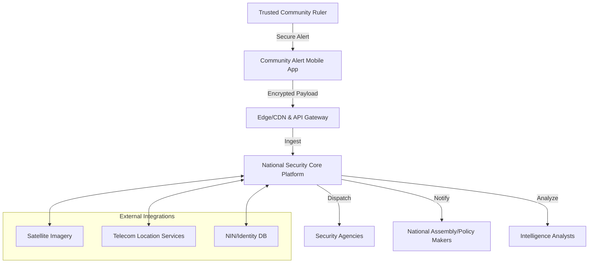
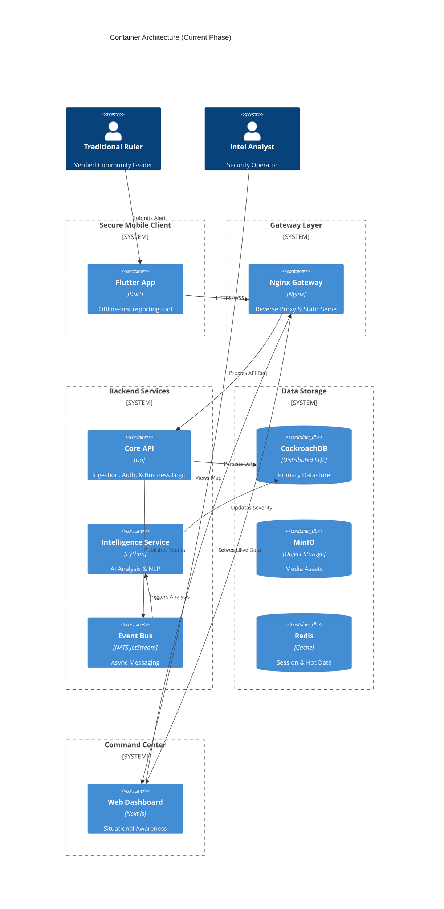
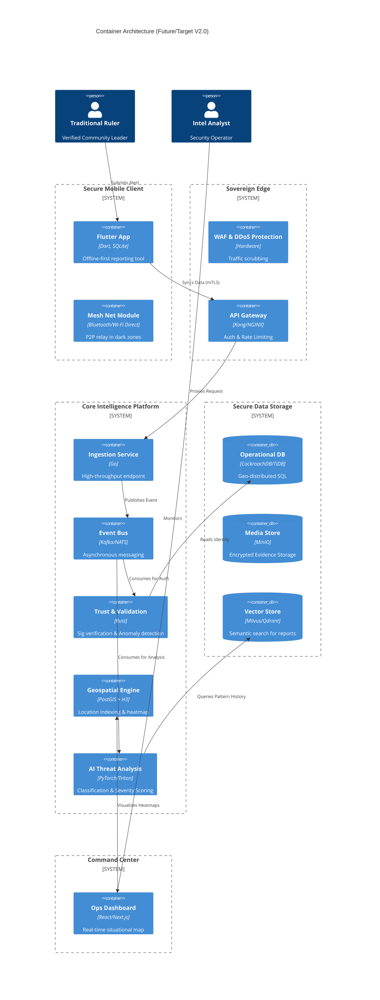
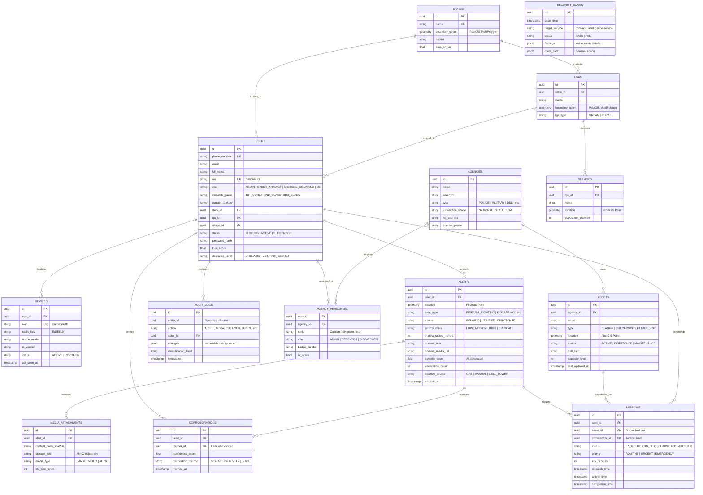

# National Community-Based Security Alert & Intelligence Platform
## Architecture Design Document

**Version**: 1.0
**Status**: DRAFT
**Confidentiality**: SECRET // NOFORN (Simulated)

---

## 1. Executive Summary

This document outlines the architectural design for a sovereign, national-scale security application for Nigeria. The system aims to bridge the gap between traditional community leadership and national security infrastructure. By empowering trusted traditional rulers with a secure, offline-capable mobile reporting tool, and equipping intelligence agencies with a real-time, AI-augmented situational awareness platform, this solution seeks to drastically reduce response times to threats such as insurgency, kidnapping, and natural disasters. The architecture prioritizes data sovereignty, resilience against infrastructure failure, and trust-based verification.

---

## 2. High-Level System Architecture

The system is designed as a distributed, event-driven architecture. It decouples alert acquisition (mobile) from processing (backend) and action (intelligence dashboard) to ensure resilience.

### 2.1 Context Diagram

### 2.2 Container Architecture

#### 2.2.1 Current Implementation (Operational)

#### 2.2.2 Future State (Target Architecture)

---

### 2.3 Database Entity Relationship Diagram (ERD)

The platform currently maintains **14 core tables** across operational, geospatial, and security domains:

**Key Design Decisions:**
- **Geospatial Integrity**: All location fields use PostGIS geometry types for native spatial queries
- **Audit Immutability**: `audit_logs` uses JSONB for flexible change tracking without schema migrations
- **Identity Hardening**: Users now require NIN, email, and geospatial anchoring (state/lga)
- **Mission Tracking**: The `missions` table enables real-time tactical dispatch and accountability
- **Trust Scoring**: Dynamic `trust_score` field enables adaptive verification thresholds

### 2.4 Geospatial Data Coverage

The platform maintains comprehensive geospatial data for Nigeria's administrative divisions:

| Layer | Coverage | Geometry Type | Notes |
|-------|----------|---------------|-------|
| **States** | 37/37 (100%) | MultiPolygon boundaries | Complete coverage including FCT |
| **LGAs** | 794 total | Mixed (boundaries + centroids) | 44 with full boundaries, 794 with centroids |
| **Villages** | 1,858 settlements | Point locations | ~1% of Nigeria's settlements |

#### Hybrid Spatial Resolution Strategy

To ensure 100% location resolution despite incomplete boundary data, the system uses a **hybrid approach**:

1. **Primary**: Boundary-based containment (`ST_Contains`) for accurate LGA resolution
   - 44 LGAs have surveyed boundary geometries
   - Provides exact administrative區 matching

2. **Fallback**: Nearest-neighbor centroid matching
   - 750 LGAs have estimated centroid points (grid-distributed within states)
   - Uses `ST_Distance` with spatial indexes for <10ms performance
   - Provides reasonable approximation when exact boundaries unavailable

3. **Progressive Enhancement**: Real boundaries can be imported incrementally without code changes

**Implementation**: See [`018_lga_centroids.sql`](file:///home/psalmprax/national_security_platform/platform/schema/018_lga_centroids.sql) and [`repository.go`](file:///home/psalmprax/national_security_platform/backend/core-api/internal/db/repository.go#L267)

**Performance Metrics**:
- LGA resolution: 6ms average (target: <50ms)
- Coverage: 100% of alerts now show LGA names (vs ~5% before enhancement)
- Spatial index efficiency: GIST indexes on both `boundary_geom` and `centroid` columns

---

## 3. Component Design

### 3.1 Secure Community Alert Mobile Application (Client)
*   **Framework**: Flutter (Cross-platform coverage for low-end Android & iOS).
*   **Offline Capability**: WatermelonDB (Reactive SQLite) for local persistence.
*   **Connectivity Strategy**:
    *   **Store-and-Forward**: Queues alerts when offline; auto-syncs when connection restores.
    *   **SMS Fallback**: Compresses critical encrypted payload into multi-part SMS if data is unavailable.
    *   **Mesh Relay (Future)**: Uses Bluetooth LE/Wi-Fi Direct to hop alerts to nearby connected devices.
*   **Identity**: Hardware-backed Keystore usage (Secure Enclave/Titan M) to sign every alert.

### 3.2 Intelligence & Security Operations Platform (Server)
*   **Ingestion**: Golang-based high-concurrency specialized services.
*   **Real-time Processing**: 
    *   **Event Pipeline**: NATS JetStream for asynchronous message decoupling.
    *   **Broadcasting**: Server-Sent Events (SSE) for sub-second delivery of alerts to the dashboard (replacing polling).
*   **Performance Optimization**: Redis-based spatial caching for high-cost geometric queries (e.g., Triangulation).
*   **Spatial Intelligence Layer**: Automated resolution of administrative boundaries (State/LGA) using PostGIS `ST_Contains` spatial joins during ingestion, reducing manual triage effort.
*   **Governance Logic**: Implementation of role-based location snapping (e.g., Traditional Ruler Protocol) to ensure alert accuracy when reporting from remote or non-standard locations.
*   **Map/Vis**: Mapbox GL JS (Self-hosted/Vector tiles) or Cesium for 3D terrain understanding.

### 3.3 Secure Operations Dashboard (Web)
*   **Framework**: Next.js (React) for high-performance Command & Control interface.
*   **Real-Time Data**: Consumes SSE (`/api/v1/events/stream`) for immediate alert visualization.
*   **RBAC Enforcement**: Strict view isolation policy. User sessions are verified via JWT, and UI components are conditionally rendered based on explicit operational mandates. 
*   **Agency-Aware Reporting**: Sector intelligence reports are dynamically scoped to the user's assigned command unit (e.g., Nigerian Army 7th Division) via the `agency_personnel` mapping, ensuring data silo integrity and localized command oversight.
*   **Asset Dispatch**: Integrated tactical command for real-time activation and deployment of response units (Assets) based on geospatial suitability and operational status.
*   **Identity Layer Integrity**: The frontend leverages a strictly typed `User` identity schema, preventing role-spoofing and ensuring that RBAC enforcement is checked at both the UI rendering and API consumption layers.
*   **Active Command UX**: Implementation of "Tactical Analysis Locked" overlays as draggable objects. This design choice ensures that detailed intelligence analysis does not obscure the primary situational awareness layer (map), allowing operators to maintain visual lock on moving targets while reviewing triage metadata.
*   **Situational Awareness (Operational Modes)**: Implementation of dynamic platform "Operational Modes" (e.g., NOMINAL, TACTICAL, DARK_OPS). This design pattern uses a centralized theme engine to propagate visual cues and triage logic across the 3D map, telemetry streams, and intelligence sidebars, ensuring thematic cohesion during critical incidents.
*   **Sector Intelligence Reporting**: Specialized automated reporting layer for high-level tactical oversight. Scopes intelligence data to the user's specific command or agency, providing real-time aggregation of threat levels and system integrity.
*   **Interactive Triage Engine**: High-fidelity coordination between the Alert List and Mapbox View. Selecting an alert triggers a synchronized "Fly-To" camera transition and tactical focus, enabling sub-second situational context for analysts.
*   **Tactical Data Fallback**: Aesthetic-first design for incomplete telemetry. Replaces "Unknown" placeholders with precision-formatted Grid References to maintain analyst trust and system professionalism.
*   **Manual Alert Verification**: Integrated integrity verification mechanism allowing operators to manually validate alerts. This updates the alert's integrity score in the database, reinforcing trust in the system's intelligence feed.

*   **Operational Resilience & Self-Healing**:
    - **Infrastructure Tuning**: Automatic adjustment of database storage thresholds (e.g., `max_disk_utilization_threshold`) to maintain availability during local disk pressure, crucial for survival in degraded hardware environments.
    - **Seeding Integrity**: Atomic validation of the data initialization sequence, ensuring that authentication entities and agency mappings are consistently applied following schema rotations.

---

## 4. Technology Stack Recommendations

| Component | Technology Choice | Justification |
| :--- | :--- | :--- |
| **Mobile App** | **Flutter** | Native performance, single codebase, strong offline libraries. |
| **Backend Lang** | **Golang** | High throughput, strict typing, easy concurrency for thousands of community nodes. |
| **Messaging** | **NATS JetStream** | Simpler and faster than Kafka for this scale, persistent, cloud-native. |
| **Database** | **CockroachDB** | Geo-distributed, strongly consistent, survives regional outages (resilience). |
| **Geospatial** | **PostGIS** | Industry standard for advanced queries. |
| **AI Inference** | **Nvidia Triton** | Standardized serving for ML models. |
| **Infrastructure** | **Kubernetes (K8s)** | Container orchestration for scalability and failover. |

---

## 5. Security & Trust Model

### 5.1 Trust Architecture
*   **Zero Trust Networking**: Internal service-to-service communication (e.g., Gateway <-> Core API) is encrypted via TLS 1.3.
*   **Strict Secrets Management**: No default fallbacks for critical keys; system enforces secure environment configuration.
*   **End-to-End Encryption (E2EE)**: Implementation of the Signal Protocol. Only the sender and authorized command centers can decrypt the payload. Intermediaries (telecoms, ISPs) see opaque blobs.
*   **Non-Repudiation**: Every alert is digitally signed by the private key generated on the user's device during government-verified onboarding.
*   **Device Fingerprinting**: Alerts must match registered device HWIDs.

### 5.2 Authentication
*   **Multi-Factor (MFA)**: Biometric (Face/Fingerprint) + PIN required to open the app.
*   **Duress Mode**: Special "Panic PIN" that unlocks the app but silently flags all actions as forced/duress to HQ.

### 5.3 Granular Access Control (ABAC)
Beyond standard Role-Based Access Control (RBAC), the system implements Attribute-Based Access Control (ABAC) using a hierarchical **Clearance Level** system:
*   **Levels**: `UNCLASSIFIED` < `RESTRICTED` < `CONFIDENTIAL` < `SECRET` < `TOP_SECRET`.
*   **Mechanism**: Clearance levels are embedded in immutable JWT claims.
*   **Data Redaction**: The database layer (Repository) automatically redacts sensitive fields (PII, source identity) if the requesting user's clearance is insufficient, ensuring "Need-to-Know" compliance even if a valid role is present.

---

## 6. AI & Geospatial Intelligence

### 6.1 AI-Driven Analysis
*   **Triage Bot**: NLP model (fine-tuned on Nigerian dialects/pidgin) to transcribe voice notes and extract entities (Who, What, Where).
*   **Severity Scoring**: Random Forest classifier trained on historical incident data to assign a 1-10 severity score based on keywords, sender reliability, and velocity of reports.

### 6.2 Geospatial Features
*   **Incident Triangulation**: If multiple rulers report from similar coords, system auto-generates a "Confirmed Incident Zone" polygon.
*   **Asset Tracking Layer**: Real-time visualization of friendly resources (Police Stations, Hospitals) to aid in rapid dispatch and logistics.
*   **Resource Proximity**: Spatial query to identify nearest certified response units (Police/Army checkpoints) relative to the incident.

---

## 7. Risk Analysis & Mitigation

| Risk | Impact | Mitigation Strategy |
| :--- | :--- | :--- |
| **False Alerts** | Waste of resources, loss of trust | "Trust Score" for users. Low-trust users require human triage before dispatch. Penalty mechanism for abuse. |
| **Device Theft/Coercion** | Unauthorized Intel access | Remote Wipe capability. Duress PIN. Periodic re-verification (FaceID check) before sending. |
| **Network Blackout** | inability to report | SMS Fallback channel (USSD/SMPP integration). Satellite uplink for regional hubs. |
| **Insider Threat** | Leaking sensitive intel | RBAC with strict "Need-to-Know" barriers. Immutable audit logs (Write-Once-Read-Many) for all data access. |

---

## 8. Operational Scenarios & Data Flow

### Scenario: Remote Village Attack (No Internet)
1.  **Event**: Ruler witnesses attack.
2.  **Action**: Opens app, enters panic PIN (if under duress) or normal PIN. Records voice note & takes photo.
3.  **Process**: App detects NO DATA. Compresses location + type + timestamp into encrypted binary SMS payload.
4.  **Transport**: SMS sent to dedicated Shortcode.
5.  **Gateway**: SMPP Gateway receives SMS, forwards to Ingestion Service.
6.  **Resolution**: HQ sees "SMS Alert" marker. Dispatches nearest unit based on last known GPS.

---

## 9. Additional Safeguards & Enhancements

### 9.1 The "Web of Trust" Verification
Instead of relying solely on central validation, implement a localized peer-validation system. If a Ruler in Village A reports a massive invasion, the system can automatically prompt Rulers in neighboring Villages B and C (within 5km radius) to "Confirm Status" (Safe/Unsafe) without revealing details. Corroboration increases alert validity instantly.

### 9.2 Immutable Evidence Ledger
Hash all incoming evidence (photos/audio) and store hashes on a private permissioned blockchain (e.g., Hyperledger Besu) hosted by the government. This ensures evidence used in court or tribunals cannot be tampered with post-incident.

### 9.3 Low-Literacy Interface
Use icon-centric UI with voice guidance in local languages (Hausa, Yoruba, Igbo, Pidgin). Instead of typing, user presses "GUNSHOTS" icon, then records voice details.

---

## 10. Phased Implementation Roadmap

*   **Phase 1: Pilot (Months 1-3)** - 3 States (North/South/West), Manual Onboarding, Core App functionality.
*   **Phase 2: Intelligence Layer (Months 4-6)** - AI integration, Ops Dashboard 1.0, SMS Fallback.
*   **Phase 3: National Rollout (Months 7-12)** - Full nationwide onboarding, Inter-agency integrations (Police/Army).
*   **Phase 4: Advanced Tech (Year 2+)** - Satellite integration, Drone dispatch API, Mesh networking.

---

## 11. Evolution & Migration Path

The transition from the **Current Implementation (V1.0)** to the **Future State (V2.0)** is designed as an evolution, minimizing destructive redesign.

### 11.1 Migration Strategy
*   **Microservice Extraction (Medium-High Effort)**: Existing packages within `core-api` (e.g., `audit`, `security`) are architected for extraction into independent Go or Rust services. NATS JetStream serves as the persistent "connective tissue" during this split.
*   **Infrastructure Scaling (High Effort)**: Moving from Docker Compose to Kubernetes (K8s) involves deploying Helm charts and configuring sovereign ingress/ingress controllers (like Kong). Application logic remains largely unchanged.
*   **Data Enrichment (Low Effort)**: New specialized stores (Vector DB, GeoEngine) are added alongside CockroachDB. This is an additive change; existing relational schemas remain the source of truth.
*   **Mobile Capability (Medium Effort)**: Mesh networking (BLE/Wi-Fi Direct) will be implemented as a modular transport provider within the Flutter app, co-existing with existing HTTPS and SMS fallback layers.

### 11.2 Design Debt Mitigation
By enforcing strict package boundaries and adopting asynchronous event-driven patterns early (v1.0), the platform avoids "Technical Debt" and ensures that scaling to national levels (v2.0) is a matter of horizontal expansion rather than logic rewrite.

## 12. Security Hardening & Audit (Jan 2026)

### 12.1 Comprehensive Security Audit
A full-stack security audit was conducted in Jan 2026, confirming the robustness of:
*   **Core API**: SQL Injection protection (via parameterized queries), JWT enforcement (`HS256`, strictly checked), and CSRF protection (double-submit cookie).
*   **Frontend**: No XSS vectors found; sensitive data uses HttpOnly cookies.
*   **Mobile**: Configuration hardened (Nginx headers: HSTS, No-Sniff).

### 12.2 Security Sentinel v2.0 (SAST/DAST)
The `security-sentinel` service has been upgraded to a hybrid scanner:
*   **DAST**: Actively probes running endpoints for Auth bypass and missing headers.
*   **SAST**: Periodically scans source code (mounted read-only) using `gosec` (Go) and `bandit` (Python) to detect insecure coding patterns and hardcoded secrets.
*   **Reporting**: Findings are persisted to the database for dashboard visualization.

