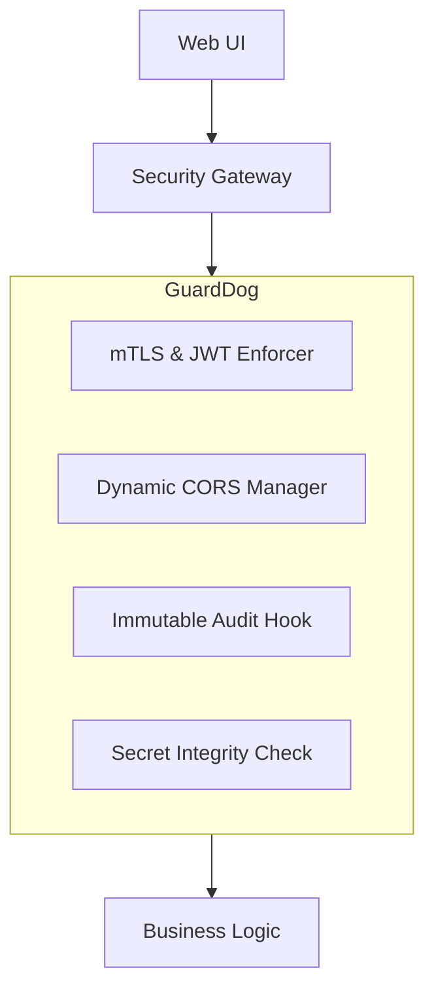

# Cybersecurity Loophole Audit Report

**Date**: 2026-01-29
**Platform**: National Security Platform (Golang Core API / Next.js Dashboard)
**Status**: CRITICAL GAPS IDENTIFIED

## 1. Executive Summary
The current implementation contains architectural security gaps that could allow unauthorized access to sensitive national security data. The primary issues stem from decentralized route handling and permissive cross-origin policies.

## 2. Identified Loopholes

### L01: Unauthenticated Sensitive Endpoints (Critical)
The following infrastructure endpoints are exposed to the public internet without any authentication:
- `/api/v1/system/status`: Leaks total user counts and system alert metrics.
- `/api/v1/system/nodes`: Leaks all registered hardware IDs (HWIDs), public keys, and device models.
- `/api/v1/agencies`: Allows anyone to register a fake security agency.
- `/api/v1/assets`: Allows anyone to list or inject fake police stations/checkpoints.

### L02: Identity & Role Bypass (High)
- **Alert Submission**: The `/api/v1/alerts` endpoint currently contains logic that skips JWT verification in "development" mode.
- **Role Enforcement**: Authorization is handled at the component level in the frontend, but the backend handles routes individually without a unified middleware stack, making it easy to forget protection on new routes.

### L03: Distributed & Permissive CORS (Medium)
- **Problem**: `Access-Control-Allow-Origin: *` is hardcoded across 8 different handlers in `main.go`.
- **Impact**: Allows malicious websites to perform Cross-Site Request Forgery (CSRF) or data exfiltration if a user is logged into the dashboard.

### L04: Insecure Secret Fallbacks (Medium)
- Both Backend and Frontend contain hardcoded strings for `JWT_SECRET` and `MASTER_ENCRYPTION_KEY` if environment variables are missing. This is a "fail-open" design rather than "fail-closed."

## 3. Recommended Remediation: "GuardDog" Module
A dedicated security module is required to enforce compliance across all environments.

### Proposed Architecture

#### Key Components:
1.  **Universal Router Middleware**: Forces all routes into a secure-by-default state.
2.  **Environment Sync**: Automatically applies stricter policies (HSTS, Secure Cookies) in production.
3.  **Endpoint Auditor**: Validates that every asset/agency request is tied to a specific per-agency authorization token (IDOR Prevention).
